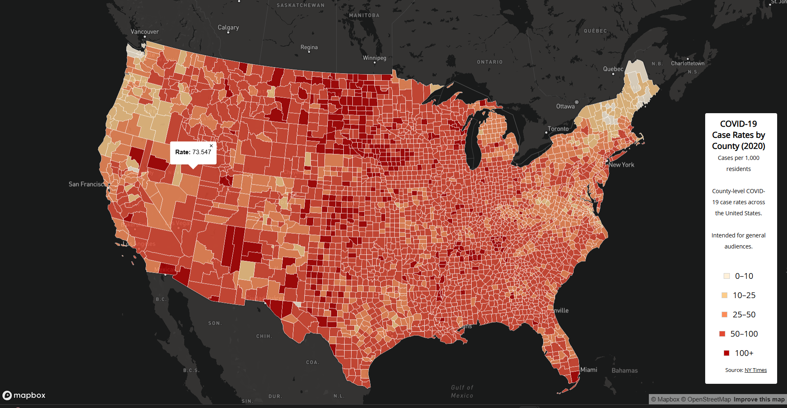

# COVID-19 Thematic Maps of the United States (2020)

## Project Overview
This project visualizes COVID-19 cases and case rates across U.S. counties in 2020. It contains **two interactive thematic maps**:

1. **Choropleth Map of COVID-19 Case Rates** (`map1.html`)  
   - Shows COVID-19 cases per 1,000 residents by county.  
   - Color-coded based on case rates to easily identify regions with higher exposure.

2. **Proportional Symbols Map of COVID-19 Cases** (`map2.html`)  
   - Displays total COVID-19 cases by county.  
   - Circle size increases proportionally with the number of cases.

These maps are intended for the **general public, policymakers, and researchers** who want to explore patterns of COVID-19 spread in 2020.

---

## Project Links

- **Choropleth Map (Case Rates):** [map1.html](https://github.com/lizbethsarabia/webmapping/blob/main/map1.html)  
- **Proportional Symbols Map (Total Cases):** [map2.html](https://github.com/lizbethsarabia/webmapping/blob/main/map2.html)

---

## Screenshots

  

---

## Primary Functions
- **Choropleth map:** Uses `fill-color` with a `step` function to map COVID-19 rates to colors.  
- **Proportional symbols map:** Uses `circle-radius` with `interpolate` for proportional sizing and `step` for color scaling based on total cases.  
- **Interactive popups:** Clicking a county shows the exact rate or total cases.  
- **Custom legend and minimalistic overlay:** Provides data source, title, and user information.  
- **Albers projection:** Both maps use the Albers projection 

---

## Libraries Used
- [Mapbox GL JS v2.8.1](https://docs.mapbox.com/mapbox-gl-js/) — for interactive web mapping  
- Google Fonts — for typography (`Open Sans`)  
- HTML/CSS/JavaScript — for map structure, legend, and overlays  

---

## Data Sources
- COVID-19 case and death data: [The New York Times GitHub](https://github.com/nytimes/covid-19-data)  
- Population data (2018 ACS 5-year estimates): U.S. Census Bureau  
- U.S. county boundaries: U.S. Census Bureau  

---

## Credits and Acknowledgments
- Inspired by **class examples of choropleth and proportional symbol maps**  
- Map styling uses the **Mapbox Dark theme** for clear visual contrast  
